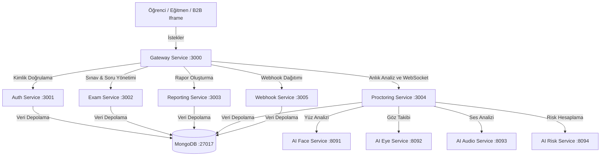

# 🎓 AI Destekli Kopya Tespitli Çevrimiçi Sınav & Gözetmenlik Platformu (Monorepo)

Bu proje; yapay zeka (AI) destekli, gerçek zamanlı kopya ve ihlal tespiti yapabilen, aynı zamanda B2B SaaS modeliyle harici platformlara (LMS, Moodle, Canvas vb.) kolayca gömülebilen (embeddable) yeni nesil bir **Çevrimiçi Gözetmenlik (AI Proctoring) ve Sınav Yönetim Sistemi**dir.

---

## 📌 İçindekiler
* [🚀 Proje Hakkında](#-proje-hakkında)
* [📁 Klasör Yapısı](#-klasör-yapısı)
* [⚙️ Kurulum ve Çalıştırma](#️-kurulum-ve-çalıştırma)
* [👥 Kullanıcı Rolleri ve Akışlar](#-kullanıcı-rolleri-ve-akışlar)
  * [👑 1. Sistem Yöneticisi (Admin) Paneli](#-1-sistem-yöneticisi-admin-paneli)
  * [👨‍🏫 2. Eğitmen (Instructor) Paneli](#-2-eğitmen-instructor-paneli)
  * [🎓 3. Öğrenci (Student) Sınav Odası ve İzin Kontrolleri](#-3-öğrenci-student-sınav-odası-ve-izin-kontrolleri)
* [🧠 Mikroservis ve AI Mimarisi](#-mikroservis-ve-ai-mimarisi)
  * [🛠️ Sistem Servisleri (Backend / Node.js)](#️-sistem-servisleri-backend--nodejs)
  * [🤖 Yapay Zeka Servisleri (AI / Python & FastAPI)](#-yapay-zeka-servisleri-ai--python--fastapi)
* [🔌 B2B SaaS Entegrasyon Modeli](#-b2b-saas-entegrasyon-modeli)


---

## 🚀 Proje Hakkında

Sistem; web kamerası ve mikrofon üzerinden aldığı verileri anlık olarak Python tabanlı yapay zeka modellerine gönderir. AI modellerinden gelen analizler sonucunda öğrencilere 0-100 arasında dinamik bir **Risk Skoru** ve seviyesi (DÜŞÜK, ORTA, YÜKSEK) atanır. İhlal sınırına ulaşan öğrencilerin sınavları otomatik olarak sonlandırılabilir.

---

## 📁 Klasör Yapısı

```text
├── frontend/                     # React (Vite) ile kodlanmış Ana Web Uygulaması
│   └── src/pages/                # Öğrenci, Eğitmen ve Yönetici (Admin) ekranları
├── sdk/                          # B2B entegrasyonu için geliştirilmiş Widget (HTML/JS)
├── services/                     # Mikroservis Mimari Servisleri (Node.js & Express)
│   ├── gateway-service/          # API Gateway: Yönlendirme, WebSocket & Webhook API (:3000)
│   ├── auth-service/             # Üye olma, Giriş ve Kullanıcı Profili yönetimi (:3001)
│   ├── exam-service/             # Sınav oluşturma, süre ve soru/cevap takibi (:3002)
│   ├── reporting-service/        # PDF & Excel formatında kopya risk raporları oluşturma (:3003)
│   ├── proctoring-service/       # WebSocket ile anlık kamera analizi ve ihlal skorlama (:3004)
│   └── webhook-service/          # Dış platformlara imzalı olay (event) teslimatı (:3005)
├── ai-services/                  # Python (FastAPI) Tabanlı Yapay Zeka Servisleri
│   ├── face-detection-service/   # Yüz algılama ve doğrulama modülü (:8091)
│   ├── eye-tracking-service/     # Bakış yönü ve ekrandan sapma kontrolü (:8092)
│   ├── audio-analysis-service/   # Ses ve konuşma tespiti modülü (:8093)
│   └── risk-scoring-service/     # Random Forest tabanlı anlık risk hesaplama (:8094)
├── scripts/                      # Kurulum, derleme ve Docker yönetim betikleri
├── DEMO_BASLAT.bat               # Tek tıkla Docker Backend + Yerel Frontend'i başlatan dosya
├── PANEL_AC.bat                  # Tarayıcıda web arayüzlerini ve test kılavuzunu açan dosya
└── b2b.md                        # Dış platformlar için B2B Widget & Webhook entegrasyon belgesi
```

---

## ⚙️ Kurulum ve Çalıştırma

Sistemi çalıştırmak için bilgisayarınızda **Docker Desktop** ve **Node.js (LTS)** yüklü olmalıdır.

### 1. Tek Tıkla Geliştirici Modu (Docker + Local Frontend)
1. Projenin ana klasöründeki **`DEMO_BASLAT.bat`** dosyasını çift tıklayarak çalıştırın.
   - Bu komut Docker backend konteynerlerini ayağa kaldıracak ve yerel React frontend sunucusunu (`http://localhost:5173`) başlatacaktır.
2. Servisler açıldıktan sonra **`PANEL_AC.bat`** dosyasını çalıştırarak test arayüzüne hemen erişebilirsiniz.

### 2. Kod Değişikliği Sonrası Docker Konteynerlerini Güncelleme
> [!IMPORTANT]
> `services/exam-service` veya diğer backend servislerinin kodlarında (özellikle denetleyici dosyalarda) bir değişiklik yaptığınızda, Docker konteynerlerindeki kodun güncellenmesi için şu komutu çalıştırarak servisleri yeniden derlemeniz gerekir:
> ```bash
> node scripts/rebuild_all.js
> ```

---

## 👥 Kullanıcı Rolleri ve Akışlar

### 👑 1. Sistem Yöneticisi (Admin) Paneli
Yönetici paneli sisteme genel bakış, eğitmen hesaplarının ve kopya raporlarının yönetilmesi amacıyla kullanılır.
* **Dashboard (Özet Ekranı):** Sistemdeki toplam aktif Eğitmen, Öğrenci, Sınav, Rapor ve aktif Davet Kodu sayılarını görsel kartlarla özetler. Son kayıt olan 5 eğitmeni ve son tamamlanan 5 sınav oturumunu listeler.
* **Eğitmenler Sekmesi:** Sistemdeki tüm eğitmenleri arama kutusuyla listeleyebilir. Her eğitmen için otomatik bir profil ve doğrulanabilir davet bağlantısı üretir.
* **Rapor Ara Sekmesi:** Sistemdeki tüm öğrencilerin sınav raporlarına (Oturum ID, Ad Soyad, Sınav Kodu) göre anında erişim ve detaylı risk analizi inceleme ekranı sunar.
* **Eğitmen Oluştur Sekmesi:** Yöneticinin sisteme doğrudan yeni bir eğitmen tanımlamasını veya eğitmenlerin üye olurken kullanacağı kayıt kodlarını üretmesini sağlar. Davet kodları otomatik olarak **taranabilir QR Kod** olarak üretilir.

### 👨‍🏫 2. Eğitmen (Instructor) Paneli
Eğitmenler kendi sınavlarını hazırlar, sınıflarını yönetir ve canlı olarak kopya analizlerini inceler.
* **Dashboard:** Eğitmenlerin oluşturduğu sınavlar ve bunlara katılan öğrencilerin anlık risk durumu izlenir.
* **Öğrenciler Sekmesi:** Eğitmene bağlı olan öğrencileri listeler ve arama yapma imkanı sağlar.
* **Rapor Ara:** Öğrencilerin tamamladığı sınavlara ait kopya risk analizlerine hızlı erişim sağlar.
* **Sınav Oluştur Sekmesi:** Eğitmenlerin iki farklı yöntemle yeni sınav tanımlamasını sağlar:
  1. **Form Arayüzü:** Soru metni, seçenekler (A, B, C, D), doğru cevap seçimi ve puan ağırlığı arayüz üzerinden tek tek eklenir.
  2. **JSON Modu:** Eğitmenler standart bir JSON şablonu (Örn: `[{"question":"...", "options":["..."], "correctAnswer": 0, "points": 10}]`) yapıştırarak tek seferde yüzlerce soru yükleyebilirler.
  * *Oluşturulan her sınav için taranabilir bir QR Kod ve sınav katılım kodu üretilir.*

### 🎓 3. Öğrenci (Student) Sınav Odası ve İzin Kontrolleri
Öğrencilerin sınav boyunca gözetim altında tutulduğu ve soruları çözdüğü güvenli alandır.
* **Giriş ve Sınav Kodu Ekranı:** Öğrenci sisteme giriş yaptıktan sonra sınav kodunu girer. QR kod taranmışsa bu kod otomatik doldurulur.
* **Donanım ve Çevre Kontrolleri (PreExamCheck):** Sınav başlamadan önce web kamerası, mikrofon izinleri alınır, ağ bağlantısı test edilir ve tarayıcı **Tam Ekran (Fullscreen)** moduna alınır. Yüz tespiti yapılarak öğrencinin sisteme kayıtlı kişi olduğu doğrulanır.
* **Anti-Black Screen Koruması (Hata Kurtarma):** Tarayıcıların güvenlik politikaları nedeniyle otomatik tam ekran yetkisi verilemediğinde oluşan kilitlenme engellenmiştir. Bir hata oluşursa öğrenciye hata detayı ve manuel **"Sınavı Başlat"** butonu sunulur. Butona tıklanarak kullanıcı jestiyle güvenli geçiş sağlanır.
* **Anti-Cheat (Kopya Engelleme) Mekanizmaları:**
  - **Kamera Gözetimi:** Kamerada yüz algılanmaması, birden fazla yüz bulunması veya bakışların uzun süre ekran dışına kayması anlık olarak kopya ihlali sayılır.
  - **Ses Algılama:** Sınav odasında konuşma veya yüksek ses tespiti yapıldığında ihlal tetiklenir.
  - **Tarayıcı Kısıtlamaları:** Sağ tık, kopyala-yapıştır (Copy-Paste) ve geliştirici araçlarını açma kısayolları (F12, Ctrl+Shift+I vb.) tamamen engellenmiştir.
  - **Tam Ekran Koruması:** Öğrenci tam ekrandan çıktığında veya sekmeyi değiştirdiğinde sınav duraklatılır ve ihlal uyarısı gösterilir. İhlal limiti aşılırsa sınav otomatik olarak sonlandırılır (`status: terminated`).

---

## 🧠 Mikroservis ve AI Mimarisi

Sistem bir API Gateway arkasında çalışan, birbiriyle Docker ağında iletişim kuran Node.js mikroservisleri ve FastAPI AI servislerinden oluşur.



### 🛠️ Sistem Servisleri (Backend / Node.js)
1. **Gateway Service (:3000):** Tüm istemci isteklerini karşılar, kimlik doğrulamasını kontrol eder ve ilgili mikroservise (veya WebSocket kanalına) güvenli şekilde yönlendirir.
2. **Auth Service (:3001):** Kullanıcı rolleri (admin, eğitmen, öğrenci), JWT tabanlı oturum yönetimi, güvenli şifre güncellemeleri ve profil işlemlerini yönetir.
3. **Exam Service (:3002):** Sınav tanımlamalarını ve sorularını MongoDB veritabanına kaydeder. Öğrencilerin sınav sürelerini, oturum durumlarını (`started`, `submitted`, `terminated`) ve cevaplarını izler.
4. **Reporting Service (:3003):** Sınav oturumu sonlandığında toplanan tüm ihlalleri, yüz doğrulama sonuçlarını ve yapay zeka analiz raporlarını derleyerek eğitmen için PDF/Excel çıktısı üretir.
5. **Proctoring Service (:3004):** Web kamerası çerçevelerini (video frame) ve ses akışlarını WebSocket üzerinden alır, yapay zeka servislerine gönderir ve dönen sonuçları anlık olarak analiz eder.
6. **Webhook Service (:3005):** Harici B SAAS platformlarına sınav olaylarını (başlama, ihlal, bitiş) SHA256 HMAC imzalı JSON paketleriyle gerçek zamanlı iletir.

### 🤖 Yapay Zeka Servisleri (AI / Python & FastAPI)
1. **Face Detection Service (:8091):** OpenCV ve MediaPipe kullanarak kameradaki yüz sayısını doğrular, öğrencinin sınav boyunca orada olup olmadığını izler.
2. **Eye Tracking Service (:8092):** Göz bebeklerinin konumunu izleyerek öğrencinin ekrana mı yoksa ekran dışına mı (örneğin yanındaki bir kağıda/telefona) baktığını tespit eder.
3. **Audio Analysis Service (:8093):** Mikrofon gelen ses frekanslarını inceleyerek ortamda fısıltı, konuşma veya kopya sinyali olabilecek insan sesi olup olmadığını doğrular.
4. **Risk Scoring Service (:8094):** Tüm AI servislerinden gelen ihlal sayılarını ve sürelerini toplayarak, Random Forest makine öğrenmesi modeliyle öğrenciye dinamik bir **Risk Puanı (0-100)** hesaplar.

---

## 🔌 B2B SaaS Entegrasyon Modeli

Bu platform, harici sınav ve eğitim yazılımlarına gömülebilir bir katman olarak sunulur.

### 1. Iframe Entegrasyonu
Sınav arayüzüne veya kendi uygulamanıza gömmek için şu iframe şablonunu kullanabilirsiniz:
```html
<iframe
  src="http://localhost:3000/sdk/index.html?apiKey=pk_live_demo12345678901&examCode=XYZ123&studentId=student-99&studentName=Ahmet+Yilmaz"
  width="350" height="280"
  allow="camera; microphone; display-capture"
  style="border: none; border-radius: 8px; box-shadow: 0 4px 12px rgba(0,0,0,0.15);"
></iframe>
```

### 2. Webhook Dinleme ve Güvenlik (HMAC)
Sistem, olayları dış sunuculara bildirirken paketin doğruluğunu doğrulamak için `X-Webhook-Signature` başlığında SHA256 HMAC imzası gönderir.
* **Webhook Örnek Gönderimi:**
```json
{
  "event": "SESSION_TERMINATED",
  "sessionId": "exam-1-student-99-1718000000",
  "examCode": "XYZ123",
  "studentId": "student-99",
  "riskScore": 92,
  "riskLevel": "HIGH",
  "message": "Maksimum ihlal sınırına ulaşıldığı için oturum kapatıldı."
}
```

