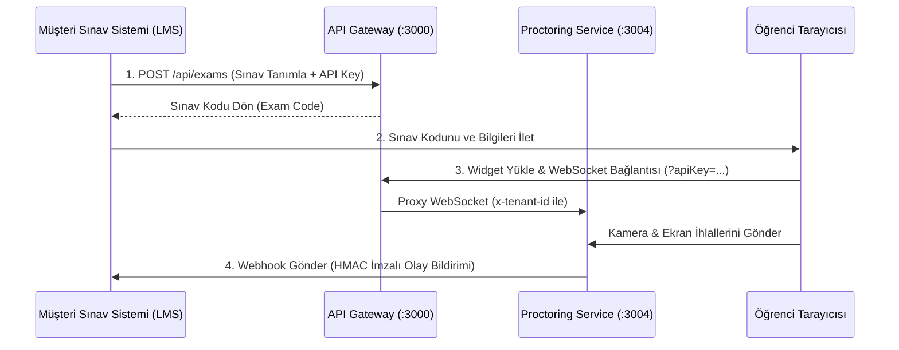

# AI Sınav Gözetim Sistemi - B2B SaaS Entegrasyon Kılavuzu

Bu kılavuz, AI Sınav Gözetim Sistemi'ni (AI Proctoring Platform) kendi eğitim veya sınav portalınıza (LMS, özel yazılım, web sitesi vb.) B2B SaaS olarak nasıl entegre edeceğinizi adım adım açıklar.

---

## 1. Mimari Genel Bakış

Sistem, çoklu kiracılık (Multi-Tenant) yapısına uygun olarak tasarlanmıştır. Her kurumsal müşteri (Tenant) kendi **API Anahtarı (API Key)** ve **Webhook Secret** anahtarına sahiptir.



---

## 2. API Gateway ve Kimlik Doğrulama

Tüm B2B API istekleri merkezi **API Gateway** üzerinden yapılır ve kimlik doğrulaması API Key ile sağlanır.

*   **Gateway URL:** `http://localhost:3000` (Geliştirme) veya canlı sunucu adresiniz.
*   **Header Kimlik Doğrulaması:** `X-API-Key: pk_live_your_api_key`
*   **Sorgu Parametresi Kimlik Doğrulaması (WebSocket/Iframe için):** `?apiKey=pk_live_your_api_key`

> [!IMPORTANT]
> API anahtarınızı (API Key) hiçbir zaman istemci tarafında (frontend/tarayıcı) kod içerisine yazmayın. API isteklerini kendi sunucunuzdan (backend) atarak anahtarınızı koruyun.

---

## 3. Sınav Oluşturma (B2B API)

Sınav sisteminizde bir sınav oluşturulduğunda, AI Proctoring sistemine bunu bildirmeli ve bir `examCode` almalısınız.

**İstek:**
```http
POST http://localhost:3000/api/exams
Content-Type: application/json
X-API-Key: pk_live_demo12345678901

{
  "title": "Veri Yapıları Vize Sınavı",
  "duration": 45,
  "status": "published"
}
```

**Yanıt:**
```json
{
  "success": true,
  "data": {
    "exam": {
      "id": "exam_64a9c8d2...",
      "title": "Veri Yapıları Vize Sınavı",
      "accessCode": "MAT82B",
      "duration": 45,
      "status": "published"
    }
  }
}
```

---

## 4. Proctoring Widget (SDK) Entegrasyonu

Öğrencinin sınav esnasında izlenebilmesi için web sayfanıza gözetim widget'ını yerleştirmeniz gerekir.

### A. Iframe ile Kolay Entegrasyon
En hızlı yöntem, gözetim ekranını bir `iframe` içinde barındırmaktır:

```html
<iframe
  src="http://localhost:3000/sdk/index.html?apiKey=pk_live_demo12345678901&examCode=MAT82B&studentId=stu_99182&studentName=Ahmet+Yilmaz"
  width="350"
  height="280"
  allow="camera; microphone; display-capture"
  style="border: none; position: fixed; bottom: 20px; right: 20px; z-index: 9999; border-radius: 8px; box-shadow: 0 4px 12px rgba(0,0,0,0.15);"
></iframe>
```

> [!WARNING]
> Iframe'in kamera, mikrofon ve ekran paylaşımı yapabilmesi için `allow="camera; microphone; display-capture"` özelliklerinin tanımlanması zorunludur.

---

## 5. Webhook Bildirimleri (Olay Takibi)

Öğrenci sınavı tamamlarken veya kopya girişiminde bulunduğunda, AI sistemi kayıtlı Webhook URL'nize POST isteği gönderir.

### Webhook Güvenliği (HMAC-SHA256 Doğrulama)
Müşteri sistemine gelen webhooks isteklerinin gerçekten AI Proctoring sisteminden geldiğini doğrulamak için `X-Webhook-Signature` başlığı kullanılır. Müşteri, isteğin gövdesini (raw body) kendi `webhookSecret` anahtarı ile SHA256 HMAC algoritmasıyla imzalamalı ve gelen imza ile karşılaştırmalıdır.

#### Node.js Webhook Doğrulama Örneği:
```javascript
const crypto = require('crypto');
const express = require('express');
const app = express();

const WEBHOOK_SECRET = 'whsec_demo12345678901234567890'; // Tenant oluşturulurken verilen secret

app.post('/webhooks/proctoring', express.raw({ type: 'application/json' }), (req, res) => {
  const signature = req.headers['x-webhook-signature'];
  
  // İmzayı hesapla
  const hmac = crypto.createHmac('sha256', WEBHOOK_SECRET);
  hmac.update(req.body);
  const expectedSignature = hmac.digest('hex');
  
  if (signature !== expectedSignature) {
    return res.status(401).send('Geçersiz İmza - Yetkisiz İstek');
  }
  
  // İstek güvenli, işleme al
  const payload = JSON.parse(req.body);
  console.log(`Etkinlik Alındı: ${payload.event}`, payload.data);
  
  res.status(200).json({ received: true });
});
```

### Webhook Payload Örnekleri

#### 1. Yüz Kaybı İhlali (Kopya Girişimi)
```json
{
  "event": "violation.detected",
  "tenantId": "tenant_demo12345",
  "timestamp": "2026-06-07T14:43:00.123Z",
  "data": {
    "sessionId": "sess_89a0b1c2",
    "examCode": "MAT82B",
    "studentId": "stu_99182",
    "violationType": "FACE_NOT_FOUND",
    "severity": "high",
    "riskScore": 75,
    "message": "Öğrenci kamerada tespit edilemedi"
  }
}
```

#### 2. Sınav Tamamlandı Bildirimi
```json
{
  "event": "session.completed",
  "tenantId": "tenant_demo12345",
  "timestamp": "2026-06-07T14:50:22.000Z",
  "data": {
    "sessionId": "sess_89a0b1c2",
    "examCode": "MAT82B",
    "studentId": "stu_99182",
    "durationSeconds": 2700,
    "finalRiskScore": 12,
    "riskLevel": "low",
    "status": "submitted"
  }
}
```

---

## 6. Admin & Tenant Yönetimi

Müşterilerinizin (Tenant) kota ve API anahtarı ayarlarını yapmak için API Gateway üzerindeki `/api/admin` yönetim uçlarını kullanabilirsiniz.

*   Bu istekler `X-Admin-Key` başlığı gerektirir.
*   **Tenant Oluşturma:** `POST /api/admin/tenants`
*   **Tenant Deaktive Etme:** `DELETE /api/admin/tenants/:id`
*   **Anahtar Yenileme:** `POST /api/admin/tenants/:id/regenerate-key`
